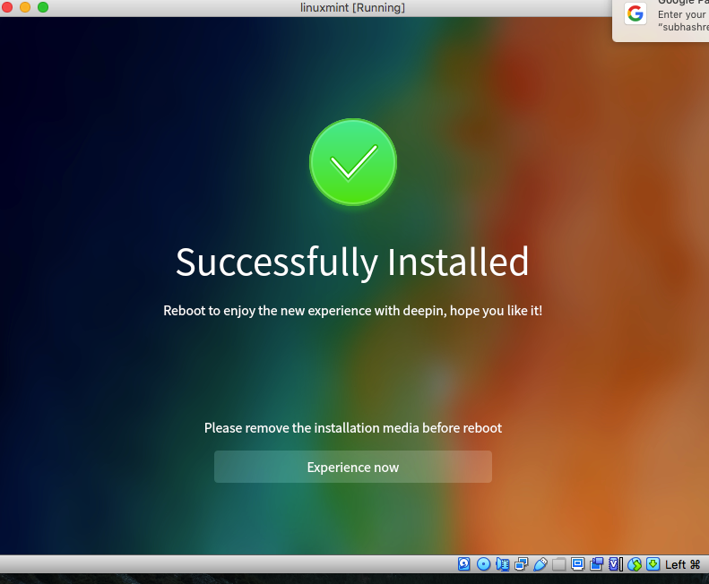
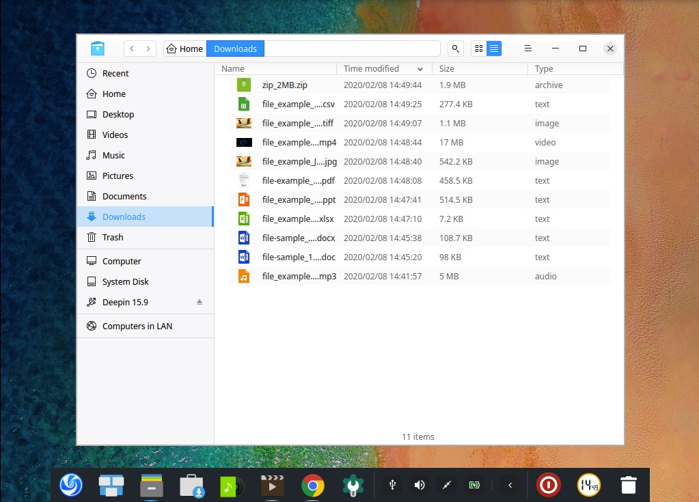

## Distro Review - Deepin Linux 15.9

## Background

I buy few magazines in India like "Opensource ForU" and "Digit". Over last few months I have accumlated a fair number of distro DVDs that come with these magazines. While going throgh some of these distros I came across Deepin OS. While I have read mixed reactions of this OS I personally never had tried it. Many said it as a Mac OS clone and a Chinese take on Linux OS. But it was always on my future review list. And when I got my hand on a Deepin OS 15.9 ISO I did this thorough review.

## Overview

As given in the [Wikipedia page](https://en.wikipedia.org/wiki/Deepin) Deepin Linux is developed by "China-based Wuhan Deepin Technology Co., Ltd" and also its desktop environment DDE, the Deepin Desktop Environment, built on Qt. This is visible in its crisp boot flash and the over expeirence of the Desktop. Deepin is unlike any other Linux desktop that I have used till now in that its UI is very crisp and can be easilly be compares with a Mac or a Windows 10. It is very much comparable with Elementary OS and in some features better.

## Boot & Install Experience

Initially the boot experience was a bit confusing given that there were 3 options in live CD first one being Install Deepin and another being Deepin failsafe. Since I did not do my online check on how to use Deepin, I just installed on my VirtualBox VM with 50 GB virtual disk and 4 GB RAM. And it took around 15-20 minutes to install the OS. 

The installation UI look and feel past the flash screen was inspired by Mac look and feel but I felt at home given my experience with Xiomi and other Chinese Mobile phones. 

I would say in some ways its installation process was similar to a first time Android Phone installation rather than a Linux installation. Which in some way will make many new users at home. I feel this OS will make many IPhone or Android or Chinese phone users easy to transition to a Laptop OS rather than from another Linux, Windows or Mac users and this is a big plus while using Deepin. 

## Desktop Experience

Once you are done with installation and into the first time setup I best thing I like about Deepin was its theme and Desktop customization. It has to out of box setup one being Windows style start menu and another being Mac style dock setup (default). I also liked the fact that it was able to identify that I am running Deepin in a VM and messaged me to install it on a real machine to get full benefits of its features. 

It has icon themes and also support for Window effects which made Deepin as one of the best modern desktop experiences so far. Though not dark and not as silver as a Mac the desktop expeirence and look and feel was right in the middle. The best thing about the desktop were the momentary soud responses as Desktop became visible and the short sound notifications as I closed some activity finished. This is someting I have got used to in Mac and hate in Windows but was soothing in Deepin.

## Bundled Apps

Deepin is loaded with many apps that makes it one of the best Linux Desktops available. It comes with WPS office suits which is much better than LibreOffice and at par if not better with MS Office suit. I spent considerable time using the Writer, Presentation and Spreadsheet apps and having used WPS office in Android earlier I was very impressed with the features it provided and compatibility with different Document formats that MS Office supports. 

This suit alone can make Deepin as a preferable alternative to many small businesses looking to migrate from Mac or Windows.

In recent times one of the major let downs for me has been lack of support for good multimedia apps as it used to be in earlier versions of Linux. And here I would say I had the best multimedia experience in Deepin than any other Linux distribution. 

The out of the box Movie, Screen Records, Screen Grabber and Music apps are one of the best in Linux Distibutions that I have tried so far. Even in the basic graphics capabilites of a Virtual Machine the response and quality of Audio and Video was very good.

## Browsing & Customizability

It comes with a Chrome browser and with a App store boasting a wide verity of free and paid apps Deepin can give a run for money and in some ways is better than Chrome OS. Also I liked its flie browser which looked modern and has support for most of the file types that I tested on Deepin. 

The experience of the Deepin window manager was a cross between Mac and windows where the window manager was trying to mimic Mac the file browser was trying to mimic Windows file browser. In the end it felt more like my Android tablet expeirence than anything I have seen on a Desktop.

One of the major draws for me using a Linux rather than a Mac or a Windows is the robust package manager that you get with a Linux distribution which makes the effort of installation of the many utilities a breeze. 

Unlike Apple or Windows store which have sparse or paid packages for your dailiy needs Linux distributions is packed to brim with commandline and free apps for almost every app or requirement you have. Deepin apart from its App store is built on top of Debian and hence support most of the packages supported with the Debian apt package system. 

As a developer we always strive for customizability and here also with support for 3rd party drivers, a side docking settings menu and a very intutive settings menu the experience was very modern and has made me seriously thing to switch to this distro. 

Also the fact that it is hihly customizable with many themes available in its App store will surely users who want a better control over their user exprience unlike Windows 10 or Mac users.

## Final Thought

For me Deepin was a direct compititor to Android Tablet and ahead of other Linux distros in terms of user experience. The most stand out feature for me was the crisp UI, multimedia expeirence and the WPS Office which made this distro not only a replacement for Windows 7 but rather a replacement for Mac or Windows 10 as well. Again I have not used this OS on a real hardware and am sure there would be some surprises in store. Also one point of concern for me was the copyright notice and a host of preperiotory apps that may not appel to Open Source purists and may be for uses who just want a cheaper or free alternative to their Windows or Mac. For me though this OS is a more good alternative to people who want to transtion to Laptop from Android phones or tablets as the look and feel of this OS is more akin to Android. 

